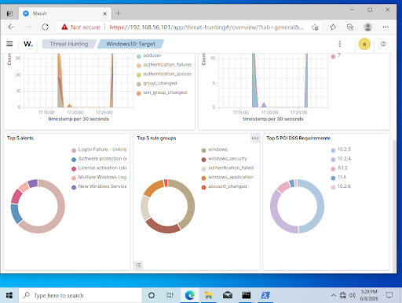
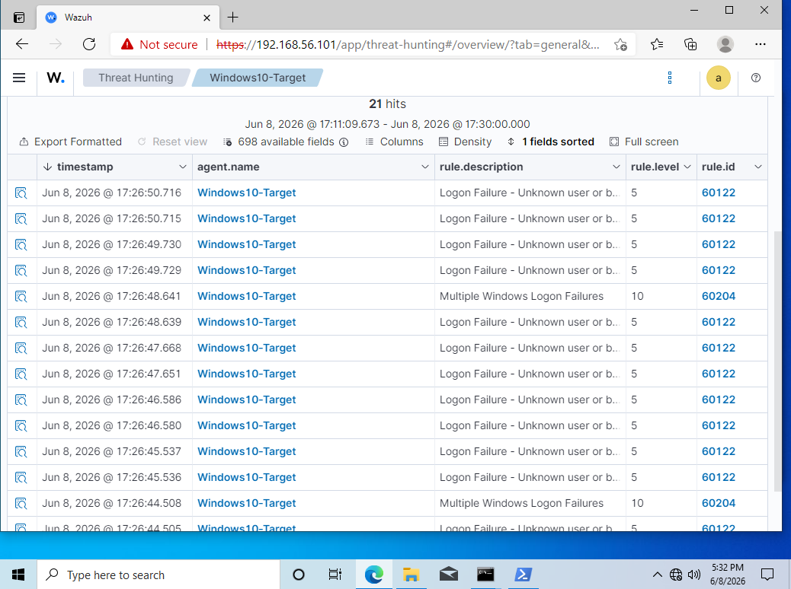
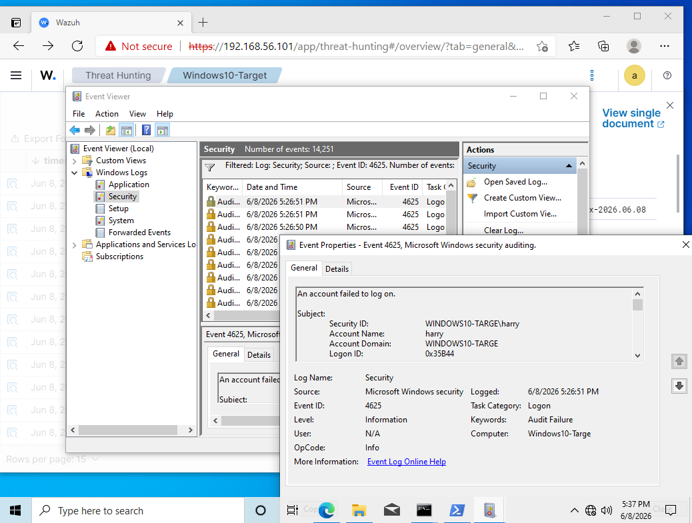

# Scenario 2 — Failed Login / Brute Force Detection

## 1. Scenario Overview

A brute force attack was simulated against a local Windows account by generating 20 rapid failed logon attempts using a PowerShell script on the Windows 10 target VM. Wazuh detected all 21 Event ID 4625 entries and grouped them under the `authentication_failed` rule group.

---

## 2. Objective

- Simulate repeated failed login attempts against a Windows target in the local lab
- Confirm Event ID 4625 is captured and alerted on by Wazuh
- Investigate the alert and verify no successful logon followed
- Document the full detection and investigation process

---

## 3. Lab Environment

| Component | Detail |
|---|---|
| Target VM | Windows 10 — 192.168.56.20 |
| Target account | `labvictim` (local account created for this scenario) |
| Attack method | PowerShell script — 20 failed logon attempts |
| Detection platform | Wazuh (agent active, reporting to 192.168.56.101) |
| Network | Host-only — isolated, no internet routing |

---

## 4. Simulated Activity

Created a test account on the Windows 10 VM:
```powershell
net user labvictim Password123! /add
```

Ran the following PowerShell script on the Windows 10 VM to generate failed logon attempts:
```powershell
$username = "labvictim"
$password = "wrongpassword"
$computer = "localhost"

1..20 | ForEach-Object {
    $securePass = ConvertTo-SecureString $password -AsPlainText -Force
    $cred = New-Object System.Management.Automation.PSCredential($username, $securePass)
    try {
        Start-Process cmd -Credential $cred -ArgumentList "/c echo test" -ErrorAction Stop
    } catch {}
    Start-Sleep -Milliseconds 500
}
Write-Host "Done - 20 failed login attempts generated"
```

> All activity performed on locally hosted virtual machines on an isolated host-only network. No external systems were targeted.

---

## 5. Logs Generated

| Log Source | Event | Count |
|---|---|---|
| Windows Security Log | Event ID 4625 — Failed Logon for `labvictim` | 21 |
| Wazuh Threat Hunting | `authentication_failed` alert group | 21 |
| Wazuh dashboard | Authentication failure counter | 21 |

---

## 6. Detection Logic

**Wazuh built-in rules fired automatically — no custom rule required.**

- Alert group: `authentication_failed`, `windows_security`
- Rule description: Logon Failure
- Event ID matched: 4625
- Target user: `labvictim`

Verified by filtering Wazuh Threat Hunting with:
```
data.win.system.eventID: 4625
```

---

## 7. Investigation Steps

1. Opened Wazuh Threat Hunting — observed 21 authentication failures spike on dashboard
2. Filtered events by `data.win.system.eventID: 4625` — returned 21 results
3. Expanded individual event and confirmed:
   - `data.win.eventdata.targetUserName` = `labvictim`
   - `data.win.system.eventID` = `4625`
   - `rule.description` = Logon Failure
4. Checked source address field to identify origin of attempts
5. Opened Event Viewer on Windows 10 VM → Windows Logs → Security → filtered for 4625 — confirmed same events visible in raw Windows logs
6. Checked for Event ID 4624 (successful logon) — **none found** — attack did not succeed

---

## 8. Evidence / Screenshots

| File | Description |
|---|---|
| `labvictim-account-created.png` | net user output confirming account creation |
| `wazuh-threat-hunting-dashboard.png` | Wazuh Threat Hunting dashboard |
| `wazuh-brute-force-alert.png` | Dashboard showing 21 authentication failures |
| `wazuh-brute-force-top5-alerts.png` | Top 5 alerts showing authentication_failed group |
| `wazuh-4625-events-filtered.png` | Filtered view — 21 x Event ID 4625 |
| `wazuh-4625-event-detail.png` | Expanded event showing targetUserName and all fields |
| `windows-event-viewer-4625.png` | Event Viewer on Windows 10 showing raw 4625 logs |





---

## 9. MITRE ATT&CK Mapping

| Field | Value |
|---|---|
| **Tactic** | Credential Access |
| **Technique** | T1110 — Brute Force |
| **Sub-technique** | T1110.001 — Password Guessing |
| **Reference** | https://attack.mitre.org/techniques/T1110/ |

---

## 10. Response / Remediation

- Block the source IP at the firewall if confirmed malicious
- Temporarily lock the targeted account
- Confirm no successful logon (Event ID 4624) followed the failures
- Enforce account lockout policy — lock after 5 failed attempts
- Enable MFA on all remote access services (RDP, SSH)
- Reset account password if any successful logon was detected

---

## 11. Lessons Learned

- Wazuh detected the brute force with no custom rules needed — built-in rules fired correctly
- Event ID 4625 is visible in both Wazuh and Windows Event Viewer simultaneously
- Filtering by `data.win.system.eventID` in Threat Hunting is a fast and effective triage method
- The critical investigation step is checking for Event ID 4624 after a cluster of 4625s — this determines whether the attack succeeded
- A real brute force from Kali using a tool like Hydra would generate a much higher volume in a shorter window

---

## 12. Status

✅ Complete — 08 June 2026
