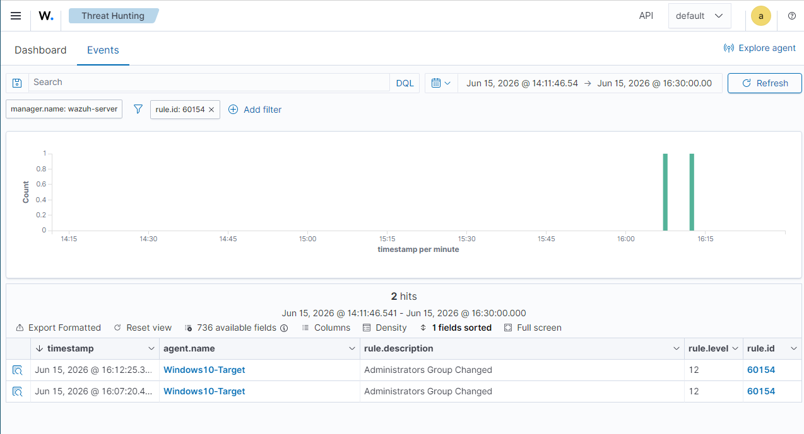
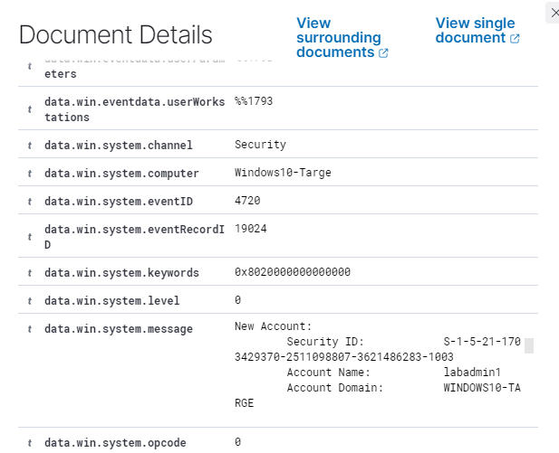

# Scenario 4 — New Administrator Account Created

## 1. Scenario Overview

Creating a new local administrator account is a common persistence technique used by attackers after gaining access to a system. It provides a backdoor that survives reboots and password changes on existing accounts. Monitoring for account creation events — particularly those adding accounts to privileged groups — is a key detection control.

---

## 2. Objective

- Simulate the creation of a new local administrator account on the Windows target VM
- Capture Windows Event Log entries for account creation and group membership changes
- Configure a detection alert in Wazuh
- Document the investigation

---

## 3. Lab Environment

| Component | Detail |
|---|---|
| Target machine | Windows 10 — 192.168.56.20 (host-only network) |
| Detection platform | Wazuh |
| Log source | Windows Security Event Log — Event IDs 4720, 4728, 4732 |
| Network | Isolated host-only adapter — no internet routing |

---

## 4. Simulated Activity

The following commands were run on the local Windows 10 VM to simulate a persistence technique:

```cmd
net user labadmin Password123! /add
net localgroup administrators labadmin /add
```

This creates a new local user `labadmin` and immediately adds it to the Administrators group — exactly the steps an attacker takes to establish a persistent backdoor account after gaining initial access.

> Executed only within the isolated lab VM (192.168.56.20) on a host-only network. No external systems were involved.

---

## 5. Logs Generated

| Log Source | Event ID | Description | Count |
|---|---|---|---|
| Windows Security Log | 4720 | User account created — target: `labadmin` | 1 |
| Windows Security Log | 4732 | Account added to local Administrators group | 2 |
| Wazuh | Rule 60154 — level 12 | "Administrators Group Changed" | 2 hits |

Key fields observed:
- `data.win.system.message` — showed "A user account was enabled" with target account `labadmin`
- Subject Account Name: `harry` (the account that created it)
- Target Account Name: `labadmin`

---

## 6. Detection Logic

**Wazuh built-in rule fired automatically — no custom rule required.**

- Rule ID: 60154
- Rule level: 12 (High)
- Description: Administrators Group Changed
- Triggered by: Event ID 4732 — account added to local Administrators group

---

## 7. Investigation Steps

1. Identify the newly created account name and when it was created
2. Determine which account created the new user (the subject/actor in the event log)
3. Check whether the new account was immediately added to a privileged group
4. Review whether the account has been used to log on (Event ID 4624) since creation
5. Look for the originating process or session — was this done interactively, remotely, or via a script?
6. Check for other persistence indicators around the same time window

---

## 8. Evidence / Screenshots

| File | Description |
|---|---|
| `wazuh-admin-group-changed.png` | Wazuh showing 2 hits for rule 60154 — Administrators Group Changed at level 12 |
| `wazuh-new-account-detail.png` | Expanded event showing target account `labadmin` and subject account `harry` |




---

## 9. MITRE ATT&CK Mapping

| Field | Value |
|---|---|
| **Tactic** | Persistence |
| **Technique** | T1136 — Create Account |
| **Sub-technique** | T1136.001 — Local Account |
| **Reference** | https://attack.mitre.org/techniques/T1136/001/ |

---

## 10. Response / Remediation

- Immediately disable and investigate the newly created account
- Determine whether the account was created by an authorised administrator or by a compromised process
- Remove the account from the Administrators group if unauthorised
- Review privileged group membership across all accounts
- Check for additional persistence mechanisms (scheduled tasks, registry run keys, services)

---

## 11. Lessons Learned

- Wazuh rule 60154 fired at level 12 automatically — no custom rule needed for this common persistence technique
- The critical combination to look for is 4720 (account created) followed immediately by 4732 (added to Administrators) — this sequence is almost always malicious
- The subject field in the event tells you WHO created the account — key for determining if this was authorised
- In a real incident the next step is checking Event ID 4624 to see if the new account has already been used to log in

---

## 12. Status

✅ Complete — 15 June 2026
