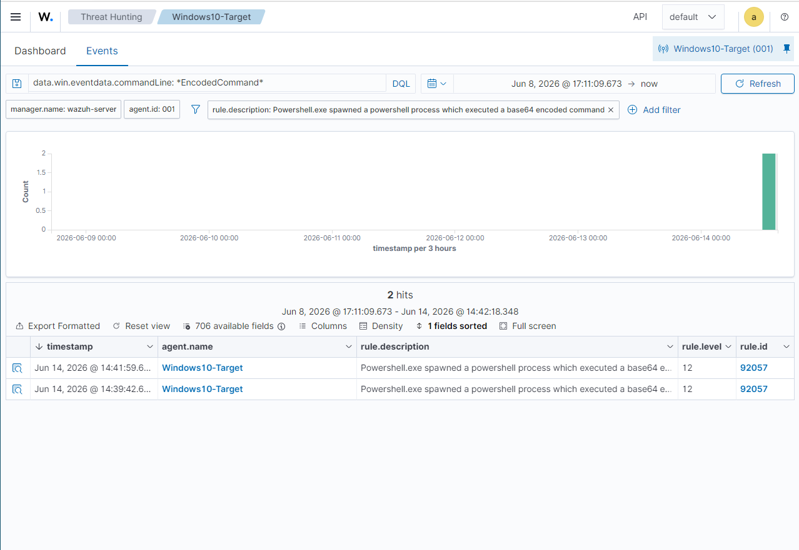
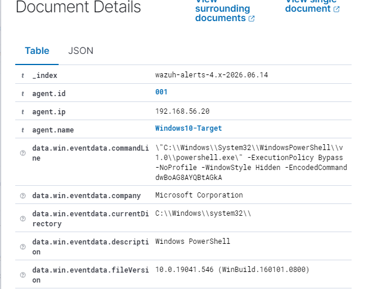

# Scenario 3 — Suspicious PowerShell Execution

## 1. Scenario Overview

Attackers frequently abuse PowerShell to execute payloads, download files, and perform reconnaissance on Windows systems. Detecting unusual PowerShell execution — particularly with encoded commands, bypassed execution policies, or non-standard parent processes — is a core SOC analyst skill.

---

## 2. Objective

- Simulate suspicious PowerShell activity on the Windows target VM in the local lab
- Capture the relevant Sysmon and Windows Event Log entries
- Create detection logic in Wazuh to identify the activity
- Document the investigation

---

## 3. Lab Environment

| Component | Detail |
|---|---|
| Target machine | Windows 10 — 192.168.56.20 (host-only network) |
| Detection platform | Wazuh (Sysmon integration) |
| Log source | Sysmon Event ID 1 (process creation), Windows Event ID 4688 |
| Network | Isolated host-only adapter — no internet routing |

---

## 4. Simulated Activity

The following command was run on the local Windows 10 VM to simulate suspicious PowerShell usage:

```powershell
powershell.exe -ExecutionPolicy Bypass -NoProfile -WindowStyle Hidden -EncodedCommand dwBoAG8AYQBtAGkA
```

Flags used and why they are suspicious:
- `-ExecutionPolicy Bypass` — overrides the policy blocking unsigned scripts
- `-NoProfile` — skips loading the user profile (stealthy behaviour)
- `-WindowStyle Hidden` — spawns the process with no visible window
- `-EncodedCommand` — runs a Base64-encoded command to obscure intent

The Base64 string `dwBoAG8AYQBtAGkA` decodes to `whoami` — harmless for lab purposes, but the flags match real-world malware loader patterns.

> All activity performed on the local Windows 10 VM (192.168.56.20) on an isolated host-only network. No external systems were contacted.

---

## 5. Logs Generated

| Log Source | Event | Detail |
|---|---|---|
| Sysmon Event ID 1 | Process creation | Full command line captured including all flags and encoded string |
| Wazuh | Rule 92057 fired — level 12 | "Powershell.exe spawned a powershell process which executed a base64 encoded command" |

Key fields observed in Wazuh:
- `data.win.eventdata.commandLine` — full command including `-WindowStyle Hidden` and `-EncodedCommand` flags
- `data.win.eventdata.parentImage` — `powershell.exe` (PowerShell spawned by PowerShell)

---

## 6. Detection Logic

**Wazuh built-in rule fired automatically — no custom rule required.**

- Rule ID: 92057
- Rule level: 12 (High)
- Description: Powershell.exe spawned a powershell process which executed a base64 encoded command
- Detection field: `data.win.eventdata.commandLine` containing `-EncodedCommand`

**Wazuh Threat Hunting query used:**
```
data.win.eventdata.commandLine: *EncodedCommand*
```

---

## 7. Investigation Steps

1. Identify the process creation event — note the full command line arguments
2. Check the parent process — was PowerShell launched by an expected parent (e.g., explorer.exe, a known admin tool) or something unusual?
3. Review whether encoded commands or execution policy bypasses were used
4. Check for any network connections made by the PowerShell process (Sysmon Event ID 3)
5. Review whether any files were created or modified (Sysmon Event ID 11)
6. Determine the user context — was this a standard user or an admin account?
7. Look for additional activity from the same user or host in the surrounding time window

---

## 8. Evidence / Screenshots

| File | Description |
|---|---|
| `wazuh-powershell-detected.png` | Wazuh Threat Hunting showing rule 92057 fired at level 12 |
| `wazuh-powershell-cmdline.png` | Expanded event showing full commandLine and parentImage fields |




---

## 9. MITRE ATT&CK Mapping

| Field | Value |
|---|---|
| **Tactic** | Execution |
| **Technique** | T1059 — Command and Scripting Interpreter |
| **Sub-technique** | T1059.001 — PowerShell |
| **Reference** | https://attack.mitre.org/techniques/T1059/001/ |

---

## 10. Response / Remediation

- Investigate the full scope of the PowerShell session — what was executed and what data was accessed
- Check for persistence mechanisms that may have been created
- Review whether encoded or obfuscated scripts were decoded and executed
- Consider restricting PowerShell execution via Constrained Language Mode or AppLocker
- Ensure PowerShell Script Block Logging is enabled (Event ID 4104)

---

## 11. Lessons Learned

- Wazuh has built-in rules for common PowerShell abuse patterns — rule 92057 fired at level 12 with no custom configuration needed
- The key investigation fields are `commandLine` (what ran) and `parentImage` (what launched it)
- `-EncodedCommand` is the biggest red flag — legitimate software almost never uses it; in a real incident the first step is decoding the Base64 to see what the hidden command actually does
- Sysmon must be configured in the Wazuh agent `ossec.conf` to forward events — it doesn't happen automatically after Sysmon is installed

---

## 12. Status

✅ Complete — 14 June 2026
