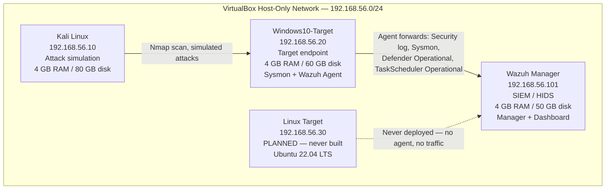

# Lab Network Topology

Host-only VirtualBox network, isolated from the internet and from the host machine's primary LAN.

## Notes

- **Hypervisor:** VirtualBox, host-only adapter — no internet egress, isolated from the host's primary LAN.
- **Linux Target (192.168.56.30):** planned in the original design (see [`network-design.md`](network-design.md)) but never built. Shown here only to document original intent — no scenario in this lab touches it.
- **Splunk:** also planned and never deployed. This is a Wazuh-only detection stack — see [`network-design.md`](network-design.md) for the full history of what was planned vs. what was actually built.
- VM specs above reflect Wazuh's documented minimum sizing for a single-node deployment and standard VirtualBox defaults for Kali/Windows 10 guests — see [`virtual-machines.md`](virtual-machines.md).
