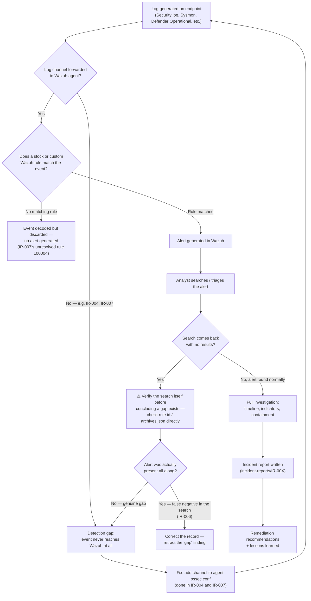

# SOC Detection Workflow

This isn't a generic textbook flow — it's shaped directly by what actually happened in this lab, including two real detection gaps (IR-004, IR-007) and one search methodology mistake that got corrected (IR-006).

## Why the verification loop exists

IR-006 documented what looked like a missing Wazuh rule for Event ID 1102 — a free-text dashboard search came back empty. A later re-investigation found the stock rule (63103) had been firing correctly the whole time, including on the original incident date; the search itself was the problem, not the SIEM. That's the `F → F1 → F2` branch above: an empty search result gets the same scrutiny as a firing alert before it's written up as a gap.

## Where this lab's two real gaps sit

- **IR-004** (Defender Operational log never forwarded) and the audit-policy half of **IR-007** (Event 4698/106 never generated at all by default) both sit at the `B1/B2` branch — the fix was at the OS/logging level, not the rule level.
- **IR-007**'s custom Sysmon rule (ID 100004) sits at `C1` — every component was confirmed correct against the live event, but it still doesn't fire, and the root cause is unidentified. This is the one open item this workflow hasn't fully closed yet.
