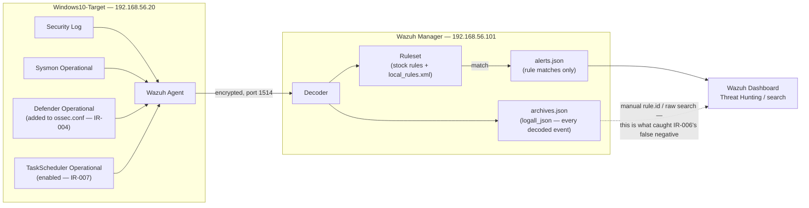

# Wazuh Architecture (This Lab)

## Notes specific to this lab

- **`archives.json` (logall_json):** disabled by default, enabled lab-wide during the hardening pass as defence-in-depth. It records every decoded event, not just rule matches — this is the only reason IR-006's missed alert could be retroactively confirmed.
- **Two log channels added mid-lab:** Defender Operational (IR-004) and TaskScheduler Operational (IR-007) are not forwarded by a stock Wazuh Windows agent config — both had to be added to `ossec.conf` manually after the gap was found.
- **Custom rule 100004 (IR-007):** lives in `local_rules.xml` on the manager, targets `schtasks.exe` persistence via Sysmon. Despite matching the decoder, event ID, and command-line pattern independently, it does not fire in this deployment — root cause unresolved (see [`../detection-rules/wazuh-rules.md`](../detection-rules/wazuh-rules.md)).
- The Linux Target (192.168.56.30) was never built, so there is no second agent in this architecture — only one Windows agent reports to the manager.
