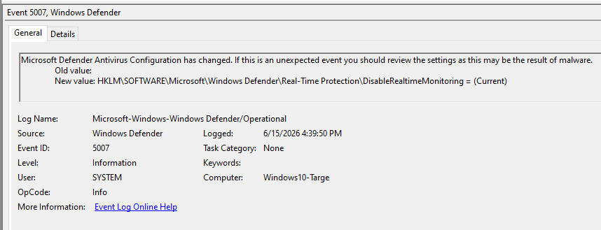
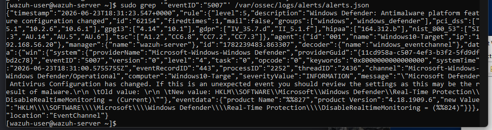
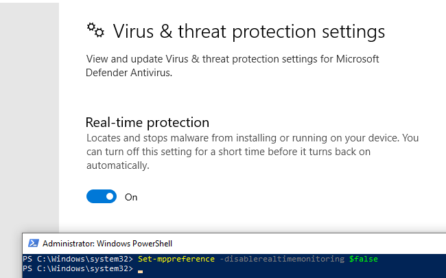

# Incident Report — Windows Defender Real-Time Protection Disabled

**Incident ID:** IR-004-2026
**Date Created:** 2026-06-15
**Analyst:** Harry
**Severity:** High
**Status:** Closed (rule coverage retested 2026-06-23)

---

> **Addendum (2026-06-23):** At the time this report was originally closed, the `ossec.conf` forwarding fix below had not been retested to confirm a Wazuh rule actually fires on Event ID 5007 once forwarded — that was tracked as an open item in `detection-rules/wazuh-rules.md`. Retested today: real-time protection was disabled again, Event ID 5007 logged locally as expected, and `sudo grep '"eventID":"5007"' /var/ossec/logs/alerts/alerts.json` on the manager returned a match against Wazuh's stock **Rule 62154** ("Windows Defender: Antimalware platform feature configuration changed," level 5). No custom rule was needed. This closes the rule-coverage gap; see Section 10 for the alert and `detection-rules/wazuh-rules.md` for the updated status.

---

## 1. Executive Summary

On 15 June 2026, Event ID 5007 was logged on `Windows10-Target` (192.168.56.20) showing Windows Defender real-time protection had been switched off via a registry change. Defender getting disabled is a defence evasion move — an attacker does this before dropping a payload so AV doesn't catch it. What I noticed during investigation is that Wazuh didn't alert on this at all, because the Windows Defender Operational log channel wasn't being forwarded. I found it in Event Viewer directly, then fixed the gap by adding the channel to `ossec.conf`. Protection was re-enabled immediately and no follow-on activity was observed.

---

## 2. Incident Overview

| Field | Detail |
|---|---|
| **Incident Type** | Defence Evasion — Security Tool Disabled |
| **MITRE Technique** | T1562.001 — Impair Defenses: Disable or Modify Tools |
| **Affected Host** | Windows10-Target — 192.168.56.20 |
| **Affected Tool** | Windows Defender — Real-Time Protection |
| **Actor** | SYSTEM (PowerShell running as Administrator) |
| **Detection Time** | 2026-06-15 16:49 UTC |
| **Environment** | Isolated home lab — host-only network 192.168.56.0/24 |

---

## 3. Detection Source

**Platform:** Windows Event Viewer — Windows Defender Operational Log
**Log channel:** `Microsoft-Windows-Windows Defender/Operational`
**Event ID:** 5007 — Microsoft Defender Antivirus Configuration Changed
**Note:** This log channel is separate from the main Security log and wasn't being forwarded to Wazuh. The gap was identified and fixed during this investigation by adding the channel to the agent `ossec.conf`.

---

## 4. Timeline of Events

| Timestamp | Event | Log Source | Notes |
|---|---|---|---|
| 2026-06-15 16:49:27 | Windows Defender real-time protection disabled | Windows Defender Operational — Event ID 5007 | Registry key: DisableRealtimeMonitoring set |
| 2026-06-15 16:49:27 | Actor: SYSTEM | Event log — User field | Executed via PowerShell running as Administrator |
| 2026-06-15 16:50:00 | No malware execution or file creation observed | Sysmon Event ID 1, 11 | No follow-on activity detected |
| 2026-06-15 16:50:30 | Windows Defender real-time protection re-enabled | Windows Defender Operational — Event ID 5007 | Immediate remediation |
| 2026-06-15 16:51:00 | Windows Security confirmed protection active | Windows Security app | Visual confirmation |

---

## 5. Indicators Observed

| Indicator Type | Value | Notes |
|---|---|---|
| Affected Host | Windows10-Target — 192.168.56.20 | Local Windows 10 endpoint |
| Event ID | 5007 | Windows Defender configuration changed |
| Registry Key | `HKLM\SOFTWARE\Microsoft\Windows Defender\Real-Time Protection\DisableRealtimeMonitoring` | Set to enabled (protection disabled) |
| Actor | SYSTEM | PowerShell `Set-MpPreference` command run as Administrator |
| Log Channel | Microsoft-Windows-Windows Defender/Operational | Separate channel from main Security log |

---

## 6. Investigation Notes

**Step 1 — Event identification**
Found Event ID 5007 in Event Viewer under `Applications and Services Logs → Microsoft → Windows → Windows Defender → Operational`. The message stated: *"Microsoft Defender Antivirus Configuration has changed. If this is an unexpected event you should review the settings as this may be the result of malware."*

**Step 2 — Identified what changed**
The event showed `HKLM\SOFTWARE\Microsoft\Windows Defender\Real-Time Protection\DisableRealtimeMonitoring` had been modified. That registry key directly controls real-time scanning — flip it and Defender stops watching for malware.

**Step 3 — Identified the actor**
The User field showed `SYSTEM` — elevated PowerShell. On a live endpoint this is where I'd want to know what process called `Set-MpPreference` and how it got admin rights in the first place.

**Step 4 — Checked for follow-on activity**
Reviewed Sysmon in the window between Defender going off and coming back on. No process creation (Event ID 1), no network connections (Event ID 3), no files dropped (Event ID 11). The exposure window was short and nothing ran in it.

**Step 5 — SIEM gap**
Wazuh had no alert for this because the Defender Operational channel wasn't in `ossec.conf`. The event only existed locally in Event Viewer. Added the channel during this investigation — future events will now forward to Wazuh.

**Conclusion:** True positive. Defender was disabled. No malicious activity in the exposure window. Detection gap found and fixed. On a live endpoint, AV being disabled with no change ticket would be an immediate P1.

---

## 7. Containment Actions

- Re-enabled real-time protection: `Set-MpPreference -DisableRealtimeMonitoring $false`
- Confirmed active via Windows Security app
- Added `Microsoft-Windows-Windows Defender/Operational` to Wazuh `ossec.conf` to close the detection gap
- Checked Sysmon in the exposure window — nothing ran

---

## 8. Remediation Recommendations

- Enable **Tamper Protection** in Defender settings — this blocks PowerShell from disabling Defender even as admin, which would have prevented this scenario entirely
- Forward the Defender Operational log channel to Wazuh on all endpoints via `ossec.conf`
- Alert on Event ID 5007 where a protection feature is being disabled
- Any AV changes should require a documented change request — unplanned changes mean immediate investigation

---

## 9. Lessons Learned

- Event ID 5007 lives in a completely separate log channel from the Security log — it won't reach a SIEM unless explicitly configured. This is a gap that probably exists in a lot of environments
- Tamper Protection would have stopped this lab scenario from working at all — which makes it a critical control to have enabled
- When Defender gets disabled, the first question is always what ran in the minutes after — that's the actual threat
- Wazuh only sees what you tell it to forward — regular `ossec.conf` audits should be part of SOC operations

---

## 10. Evidence

| # | Evidence Item | Source |
|---|---|---|
| 1 | `defender-disabled-event5007.png` | Windows Event Viewer — Event ID 5007 showing configuration change |
| 2 | `defender-reenabled.png` | Windows Security app — real-time protection confirmed active |
| 3 | Raw Event Viewer export — Event ID 5007 | [`../sample-logs/5007-defender-disabled-sample.xml`](../sample-logs/5007-defender-disabled-sample.xml) |
| 4 | `wazuh-defender-5007-retest.png` | (Added 2026-06-23) `alerts.json` grep on the manager confirming stock Rule 62154 fired on Event ID 5007 |

---

*MITRE ATT&CK: https://attack.mitre.org/techniques/T1562/001/*
*Report prepared as part of the SOC Detection Lab portfolio project. All activity was performed in a private, isolated, locally hosted lab environment.*
