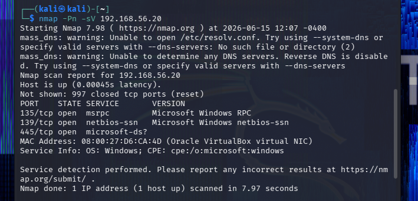

# Incident Report — Network Port Scan Detected

**Incident ID:** IR-005-2026
**Date Created:** 2026-06-15
**Analyst:** Harry
**Severity:** Medium
**Status:** Closed

---

## 1. Executive Summary

On 15 June 2026, an Nmap scan was run from the Kali Linux VM (192.168.56.10) against `Windows10-Target` (192.168.56.20). The scan found three open ports: 135 (RPC), 139 (NetBIOS), and 445 (SMB). Wazuh didn't alert on any of it — which was expected, since Wazuh is a HIDS and port scanning doesn't generate Windows events. This report documents the detection gap and what would actually be needed to catch this kind of activity. No exploitation followed the scan.

---

## 2. Incident Overview

| Field | Detail |
|---|---|
| **Incident Type** | Network Reconnaissance — Port Scan |
| **MITRE Technique** | T1046 — Network Service Discovery |
| **Source Host** | Kali Linux — 192.168.56.10 |
| **Target Host** | Windows10-Target — 192.168.56.20 |
| **Scan Tool** | Nmap 7.98 |
| **Detection Time** | 2026-06-15 11:58 UTC (attacker terminal only — no SIEM alert) |
| **Environment** | Isolated home lab — host-only network 192.168.56.0/24 |

---

## 3. Detection Source

**Platform:** Kali Linux terminal — attacker-side evidence only
**SIEM alert:** None
**Why:** Wazuh is a HIDS — it processes events on the Windows host. An Nmap scan hitting the network adapter doesn't create any Windows Event Log entries, so Wazuh had nothing to fire on. Catching this would need a NIDS like Suricata sitting on the network, or Windows Firewall logging enabled and forwarded.

---

## 4. Timeline of Events

| Timestamp | Event | Source | Notes |
|---|---|---|---|
| 2026-06-15 11:57 | Windows Firewall disabled on target | Windows CMD — netsh | Needed to reveal actual open ports |
| 2026-06-15 11:58 | Nmap scan started: `nmap -Pn -sV 192.168.56.20` | Kali Linux terminal | -Pn skips ping — Windows blocks ICMP by default |
| 2026-06-15 12:07 | Scan finished — 3 open ports found | Nmap output | 135, 139, 445 |
| 2026-06-15 12:08 | Windows Firewall re-enabled | Windows CMD — netsh | Immediate |
| 2026-06-15 12:10 | Wazuh checked — no recon alerts | Wazuh Threat Hunting | HIDS limitation confirmed |

---

## 5. Indicators Observed

| Indicator Type | Value | Notes |
|---|---|---|
| Source IP | 192.168.56.10 | Kali Linux attack VM |
| Target IP | 192.168.56.20 | Windows 10 target |
| Scan Tool | Nmap 7.98 | |
| Open Ports | 135/tcp, 139/tcp, 445/tcp | RPC, NetBIOS, SMB |
| Scan Type | TCP SYN + service version detection (-sV) | |

---

## 6. Investigation Notes

**Scan results**
Nmap completed in ~8 seconds with `-Pn` (no host discovery) and `-sV` (version detection). Three ports came back open:

| Port | Service | Notes |
|---|---|---|
| 135/tcp | Microsoft RPC | DCOM attack surface |
| 139/tcp | NetBIOS | Legacy, usually worth disabling |
| 445/tcp | SMB | EternalBlue / MS17-010 — highest risk port here |

Port 445 is the one that matters most. That's the port WannaCry used. On any endpoint with 445 open the first check is always patch status against MS17-010.

**SIEM check**
Checked Wazuh with `rule.groups: recon` — nothing returned. Expected. The Windows host doesn't know it's being scanned — the SYN packets hit the network stack and either get a response or don't. No log entry is generated without Firewall logging enabled.

**HIDS vs NIDS**
This scenario is a good illustration of why defence in depth matters. Wazuh sees everything that happens *on* the host. It's blind to traffic that doesn't generate a host event. A NIDS like Suricata would have seen the SYN scan pattern immediately. Both layers are needed.

**Firewall observation**
When the Windows Firewall was on, Nmap showed all ports as filtered — the scan was useless. Re-enabled straight after. That's a reminder that the firewall isn't just blocking exploitation, it's also blocking reconnaissance.

**Conclusion:** Gap documented. No SIEM detection, no exploitation. Adding Suricata to this lab is the obvious next step to close this.

---

## 7. Containment Actions

- Windows Firewall re-enabled immediately: `netsh advfirewall set allprofiles state on`
- Nothing else to contain — no exploitation occurred

**To actually detect this:**
- Deploy Suricata — it has built-in Nmap detection signatures
- Enable Windows Firewall connection logging: `netsh advfirewall set allprofiles logging droppedconnections enable` and forward to Wazuh

---

## 8. Remediation Recommendations

- Deploy a NIDS (Suricata) integrated with Wazuh
- Keep Windows Firewall enabled — with it on, Nmap got nothing useful
- Disable SMB v1: `Set-SmbServerConfiguration -EnableSMB1Protocol $false`
- Verify MS17-010 patch status on all Windows systems with port 445 open

---

## 9. Lessons Learned

- Wazuh not alerting here isn't a Wazuh failure — it's working as designed. Knowing what a tool *can't* do is as important as knowing what it can
- `-Pn` is standard Nmap practice against Windows targets because ICMP is blocked by default — "no ping response" doesn't mean the host is down
- Port 445 open should always prompt a patch verification before anything else
- The firewall being off was what made the scan useful — that's a strong argument for never disabling it outside a controlled test

---

## 10. Evidence

| # | Evidence Item | Source |
|---|---|---|
| 1 | `nmap-scan-results.png` | Kali Linux terminal — Nmap output |

---

*MITRE ATT&CK: https://attack.mitre.org/techniques/T1046/*
*Report prepared as part of the SOC Detection Lab portfolio project. All activity was performed in a private, isolated, locally hosted lab environment.*
