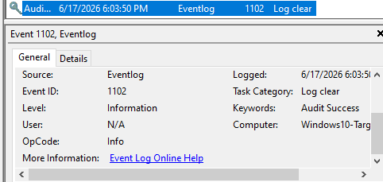
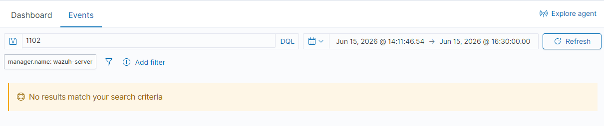
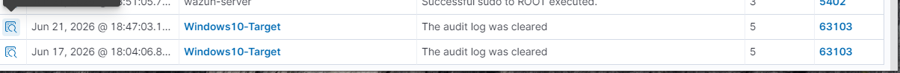

# Incident Report — Security Event Log Cleared

**Incident ID:** IR-006-2026
**Date Created:** 2026-06-17
**Analyst:** Harry
**Severity:** High
**Status:** Closed (corrected 2026-06-21)

---

> **Addendum (2026-06-21):** The original conclusion below — that Wazuh had no rule covering Event ID 1102 — was incorrect. A later re-investigation found Wazuh's stock ruleset already alerts on this event (rule 63103), and that the alert had actually fired on the original incident date too. The root cause was a flawed search on my part, not a SIEM gap. Full details in Section 6, Step 6. Conclusion, Remediation, and Lessons Learned have been updated accordingly; the original investigation steps are left intact below for an honest record of how the mistake happened.

---

## 1. Executive Summary

On 17 June 2026, the Security event log on `Windows10-Target` (192.168.56.20) was cleared using `wevtutil cl Security` — a classic anti-forensics move attackers use to erase evidence after gaining access. Clearing a log doesn't go unnoticed: Windows logs a fresh Event ID 1102 the moment the log re-opens empty, so the action itself leaves a trace even as it destroys everything before it. I found the 1102 entry in Event Viewer; at the time, a Wazuh Threat Hunting search for it came back empty, which I documented as a detection gap. A later re-investigation (2026-06-21, see addendum) found that conclusion was wrong — Wazuh's stock ruleset had already alerted on this exact event correctly, including on this same date. The real finding here ended up being about validating my own search methodology before trusting a "no results" result, not a SIEM gap.

---

## 2. Incident Overview

| Field | Detail |
|---|---|
| **Incident Type** | Anti-Forensics — Security Log Cleared |
| **MITRE Technique** | T1070.001 — Indicator Removal: Clear Windows Event Logs |
| **Affected Host** | Windows10-Target — 192.168.56.20 |
| **Actor** | `harry` (administrator, elevated CMD) |
| **Detection Time** | 2026-06-17 14:02 UTC (Event Viewer). Wazuh rule 63103 confirmed to have alerted the same day — see addendum; this was missed by my original search, not by Wazuh. |
| **Environment** | Isolated home lab — host-only network 192.168.56.0/24 |

---

## 3. Detection Source

**Platform:** Windows Event Viewer — Security log
**Event ID:** 1102 — "The audit log was cleared"
**SIEM alert:** Wazuh rule 63103 ("The audit log was cleared," level 5, MITRE T1070) — confirmed to have fired on the original incident date. My original Threat Hunting search missed it; the alert itself was never missing.
**Why:** Covered in Investigation Notes (Step 3–4) and the 2026-06-21 addendum (Step 6). This was never a forwarding or ruleset gap — the Security channel reaches Wazuh fine, and Wazuh's stock ruleset already ships a correctly-tagged rule for Event ID 1102.

---

## 4. Timeline of Events

| Timestamp | Event | Source | Notes |
|---|---|---|---|
| 2026-06-17 14:00 | Security log cleared: `wevtutil cl Security` | Elevated CMD | Run as `harry` (administrator) |
| 2026-06-17 14:00 | Event ID 1102 logged | Windows Security Log | Logged immediately as the log re-opens empty |
| 2026-06-17 14:02 | Event Viewer checked | Windows Event Viewer | 1102 confirmed as effectively the only entry left |
| 2026-06-17 14:05 | Wazuh Threat Hunting searched for Event ID 1102 | Wazuh | No alert, no raw event returned — **later found to be a search error, not a true negative** |
| 2026-06-17 18:04 | Wazuh rule 63103 alert generated (confirmed retroactively) | Wazuh — `wazuh-alerts-*` | Discovered 2026-06-21 via `rule.id:63103` search — the alert was present in Wazuh the whole time |
| 2026-06-17 14:10 | Gap documented (incorrectly) | — | Original report concluded no default rule existed |
| 2026-06-21 | Re-investigation and correction | Wazuh / this report | See Step 6 — confirmed stock rule 63103 covers this event; original conclusion retracted |

---

## 5. Indicators Observed

| Indicator Type | Value | Notes |
|---|---|---|
| Affected Host | Windows10-Target — 192.168.56.20 | Local Windows 10 endpoint |
| Event ID | 1102 | "The audit log was cleared" |
| Tool | `wevtutil.exe` | Built-in Windows utility — no third-party tooling needed |
| Actor | `harry` | Administrator account, elevated prompt |
| Log Channel | Security | Same channel that already forwards 4625/4720/4732 successfully |
| Wazuh Rule | 63103 | Stock rule, level 5, MITRE T1070 — confirmed firing correctly (see addendum) |

---

## 6. Investigation Notes

**Step 1 — Ran the simulated action**
`wevtutil cl Security` from an elevated CMD. This is the exact command (or its `Clear-EventLog` PowerShell equivalent) real attackers run right after achieving whatever they came in to do, to erase the trail that would show how they got there.

**Step 2 — Confirmed in Event Viewer**
Opened the Security log directly — Event ID 1102 was sitting there as essentially the only entry. Everything that happened before the clear is gone. That's the actual damage in this scenario: it's not just that an event fired, it's that the history behind it no longer exists.

**Step 3 — Checked Wazuh**
Searched Threat Hunting for Event ID 1102. Nothing came back — no alert, no raw record. At the time I took this at face value: the Security channel is already proven to forward correctly, since 4625/4720/4732 all reached Wazuh in previous incidents, so I assumed the pipe was open but the alert just never fired.

**Step 4 — Conclusion at the time (retracted — see Step 6)**
I concluded that Wazuh's manager only retains events that match a rule in the ruleset, that nothing in the stock ruleset was watching for Event ID 1102 specifically, and that this explained the empty search. **This was wrong.** A stock rule for this exact event already existed.

**Step 5 — Assessed severity**
An attacker clearing logs almost always means they've already done something they don't want found. On its own, Event ID 1102 should be one of the highest-priority alerts a SOC has, because by the time it fires, whatever evidence came before it is already gone. This assessment still stands regardless of the correction below.

**Step 6 — Re-investigation and correction (2026-06-21)**
While doing a post-incident hardening pass, I went to write a custom Wazuh rule for Event ID 1102 — and before writing one from scratch, checked whether stock coverage already existed: `sudo grep -rl "63103" /var/ossec/ruleset/rules/`. It did. Rule 63103 in Wazuh's stock `0610-win-ms_logs-rules.xml` matches `win.system.eventID == 1102`, level 5, tagged MITRE T1070, with a sibling rule (63104) covering Event ID 104 ("a Windows log file was cleared"). I regenerated the event (`wevtutil cl Security` again) and confirmed in `archives.json` that rule 63103 matched immediately and correctly.

To check whether this was new behavior from enabling the archives module during this hardening pass, or had been true all along, I searched the Wazuh dashboard's Threat Hunting view for `rule.id:63103` with no date restriction. Two results came back: the retest just performed, **and a match from 2026-06-17 18:04:06 — the original incident date.** The alert had been sitting in Wazuh, correctly classified, the entire time. My Step 3/4 conclusion was incorrect: this was never a missing-rule problem. The most likely explanation is that my original search queried free-text `1102` against the dashboard rather than the indexed `rule.id` or event-ID field, and it simply didn't match. Lesson taken: verify the query itself before concluding a detection gap exists.

**Conclusion:** True positive on the simulated action — log cleared, 1102 confirmed in Event Viewer. The detection gap originally documented in this report did not exist: Wazuh's stock rule 63103 alerted on this event correctly, including on the original incident date. The actual finding here, post-correction, is a methodology one — my original search technique produced a false negative, not the SIEM. Unlike IR-004 (a genuine forwarding gap), this is a reminder that an empty search result doesn't always mean an empty detection.

---

## 7. Containment Actions

- No way to reverse a cleared log — the cleared data is unrecoverable from this host
- Originally documented as a detection gap; corrected 2026-06-21 after confirming stock rule 63103 already covers this event and had fired correctly
- Confirmed the Security channel itself is healthy (other event IDs from the same channel still forward correctly)

---

## 8. Remediation Recommendations

- No new Wazuh rule needed for Event ID 1102 — stock rule 63103 already covers it correctly (level 5, MITRE T1070) and was confirmed firing on both the original incident date and a 2026-06-21 retest
- Before documenting a "detection gap," verify the search itself: query by `rule.id` or the indexed event-ID field rather than free text, and cross-check `archives.json` directly if a rule match is in doubt
- The archives module (`logall_json`) has been enabled lab-wide regardless, as defense-in-depth for any future event that genuinely has no matching rule — it just wasn't the actual fix for this case
- Restrict who can clear the Security log to break-glass admin accounts only, and monitor use of that access itself
- Forward logs to a second, independent collector so a local clear doesn't destroy the only copy of the evidence

---

## 9. Lessons Learned

- Event ID 1102 is more dangerous in what it implies than in itself — it's a sign something else already happened and got erased
- The real lesson from this report wasn't about Wazuh's ruleset — it was about verifying my own search before trusting a "no results" finding. A free-text dashboard search missed an alert that was correctly tagged and sitting there the whole time
- Wazuh's stock ruleset already covers well-known forensic events like log clearing (MITRE T1070) out of the box — check for existing rule coverage before assuming a custom rule is needed
- An empty SIEM search result deserves the same scrutiny as an alert firing — confirm it against the raw data (`archives.json`, a `rule.id` search) before writing it up as a gap

---

## 10. Evidence

| # | Evidence Item | Source |
|---|---|---|
| 1 | `event-1102-log-cleared.png` | Windows Event Viewer — Event ID 1102 |
| 2 | `wazuh-1102-no-results.png` | Wazuh Threat Hunting — original (flawed) search for Event ID 1102 returning no results |
| 3 | `wazuh-rule-63103-confirmed-alerts.png` | Wazuh Threat Hunting — `rule.id:63103` showing matches on both the original incident date (2026-06-17) and the 2026-06-21 retest |
| 4 | Raw Wazuh alert export — rule 63103 | [`../sample-logs/63103-logcleared-alert.json`](../sample-logs/63103-logcleared-alert.json) — this is the 2026-06-21 retest match (`systemTime` 2026-06-21T17:46), not the original 2026-06-17 18:04 alert referenced in Step 6 |

---

*MITRE ATT&CK: https://attack.mitre.org/techniques/T1070/001/*
*Report prepared as part of the SOC Detection Lab portfolio project. All activity was performed in a private, isolated, locally hosted lab environment.*
