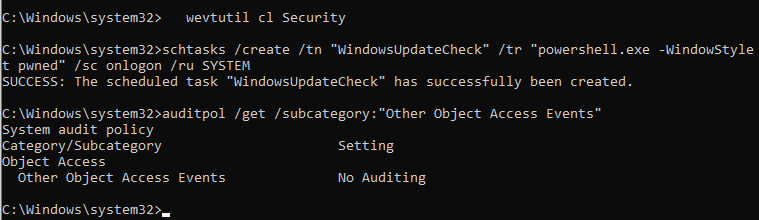
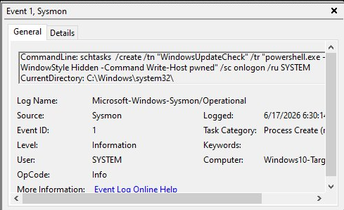
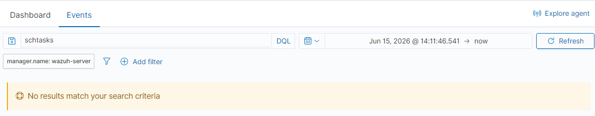

# Incident Report — Suspicious Scheduled Task Created (Persistence)

**Incident ID:** IR-007-2026
**Date Created:** 2026-06-17
**Analyst:** Harry
**Severity:** High
**Status:** Closed

---

## 1. Executive Summary

On 17 June 2026, a scheduled task named `WindowsUpdateCheck` was created on `Windows10-Target` (192.168.56.20), set to run a hidden PowerShell command at every logon as SYSTEM — a classic persistence technique disguised behind an innocuous, Windows-update-sounding name. Neither of Windows' native logging paths for this caught it: Event ID 4698 in the Security log never fired because that audit subcategory is off by default, and Event ID 106 in the Task Scheduler operational log never fired because that log channel itself is disabled by default. Sysmon was the only thing that recorded it locally, and even that never reached Wazuh as an alert — a search for the activity came back empty. This is the most complete detection gap found in this lab so far: three separate logging layers checked, three different reasons for silence.

---

## 2. Incident Overview

| Field | Detail |
|---|---|
| **Incident Type** | Persistence — Suspicious Scheduled Task Creation |
| **MITRE Technique** | T1053.005 — Scheduled Task/Job: Scheduled Task |
| **Affected Host** | Windows10-Target — 192.168.56.20 |
| **Task Name** | `WindowsUpdateCheck` |
| **Actor** | `harry` (administrator, elevated CMD) |
| **Detection Time** | 2026-06-17 06:30 UTC (Sysmon only — no Security log entry, no Task Scheduler log entry, no Wazuh alert) |
| **Environment** | Isolated home lab — host-only network 192.168.56.0/24 |

---

## 3. Detection Source

**Platform:** Sysmon Operational log (local only)
**Event ID:** 1 — Process Creation
**SIEM alert:** None — searched Wazuh Threat Hunting for `schtasks` across a date range covering the event, zero results
**Why:** Three logging layers checked. Two were disabled by default at the OS level. The third (Sysmon) worked locally but never produced an alert because no Wazuh rule matches this pattern. Full breakdown in Investigation Notes.

---

## 4. Timeline of Events

| Timestamp | Event | Source | Notes |
|---|---|---|---|
| 2026-06-17 06:30 | Scheduled task `WindowsUpdateCheck` created via `schtasks` | Elevated CMD | Hidden PowerShell, trigger `/sc onlogon`, run as SYSTEM |
| 2026-06-17 06:30 | Sysmon Event ID 1 logged the process creation | Sysmon Operational log | Full command line captured locally |
| 2026-06-17 06:31 | Checked Security log for Event ID 4698 | Windows Event Viewer | Nothing found |
| 2026-06-17 06:32 | Checked audit policy: `auditpol /get /subcategory:"Other Object Access Events"` | Elevated CMD | Setting: No Auditing |
| 2026-06-17 06:33 | Checked Task Scheduler Operational log for Event ID 106 | Windows Event Viewer | Channel itself disabled — 0 events |
| 2026-06-17 06:35 | Searched Wazuh for `schtasks` (date range corrected to cover the event) | Wazuh Threat Hunting | No results returned |

---

## 5. Indicators Observed

| Indicator Type | Value | Notes |
|---|---|---|
| Affected Host | Windows10-Target — 192.168.56.20 | Local Windows 10 endpoint |
| Task Name | `WindowsUpdateCheck` | Deliberately innocuous, blends in with legitimate Windows tasks |
| Trigger | `/sc onlogon` | Fires at every logon — survives reboots |
| Run-As | SYSTEM | Highest privilege context available on the host |
| Action | `powershell.exe -WindowStyle Hidden -Command Write-Host pwned` | Hidden window, benign payload in this lab |
| Tool | `schtasks.exe` | Built-in Windows utility — no third-party tooling needed |

---

## 6. Investigation Notes

**Step 1 — Ran the simulated action**
`schtasks /create /tn "WindowsUpdateCheck" /tr "powershell.exe -WindowStyle Hidden -Command Write-Host pwned" /sc onlogon /ru SYSTEM` from an elevated CMD. The task name is deliberately boring — looks like a Windows Update helper, which is exactly the kind of disguise real persistence relies on. Triggering on every logon and running as SYSTEM means it would survive reboots and keep re-executing indefinitely.

**Step 2 — Checked the Security log**
Filtered for Event ID 4698 ("A scheduled task was created"). Nothing there. Ran `auditpol /get /subcategory:"Other Object Access Events"` to find out why — came back "No Auditing." That subcategory isn't enabled by default on Windows 10, so 4698 simply never gets generated unless someone has explicitly turned it on. Same root-cause pattern as IR-006: this isn't the SIEM missing an event, the event itself was never created.

**Step 3 — Checked the Task Scheduler operational log**
Event ID 106 ("User registered Task Scheduler task") would be the next place to look. Opened Applications and Services Logs → Microsoft → Windows → TaskScheduler → Operational — it showed "(Disabled)," zero events. This log channel is off by default too. Two completely separate native logging paths for the same action, both disabled out of the box.

**Step 4 — Checked Sysmon**
This is what actually caught it. Sysmon Event ID 1 recorded the full command line for the `schtasks.exe` process, including the hidden PowerShell payload and the SYSTEM run-as flag. Without Sysmon deployed, this entire action would have been completely invisible on this host — no Security log entry, no Task Scheduler log entry, nothing. One thing worth flagging: the Sysmon event's User field showed SYSTEM rather than the admin account that ran the command — didn't chase that down further since it doesn't change the investigative conclusion, but in a real environment where attribution mattered, it's the kind of discrepancy worth digging into.

**Step 5 — Checked Wazuh**
Searched Threat Hunting for `schtasks` with the date range corrected to actually cover the event — zero results, even after confirming Sysmon had it locally. Same explanation as IR-006: Wazuh's manager only retains events that match a rule, and there's no default rule watching for `schtasks.exe` spawning hidden PowerShell with a SYSTEM run-as flag. The event reached the agent, got decoded, and was discarded with nothing to alert on.

**Conclusion:** True positive — persistence was successfully established and confirmed via Sysmon. Three independent logging layers checked (Security log, Task Scheduler log, Wazuh alerting), all three came back empty, for three different reasons. This is the most complete detection gap documented in this lab — only the raw local Sysmon log caught any of it, and even that never escalated into something a SOC would actually see without further tuning.

---

## 7. Containment Actions

- Removed the scheduled task: `schtasks /delete /tn "WindowsUpdateCheck" /f`
- Confirmed deletion: `schtasks /query /tn "WindowsUpdateCheck"` returned not found
- Documented all three logging gaps for remediation

---

## 8. Remediation Recommendations

- Enable the "Other Object Access Events" audit subcategory: `auditpol /set /subcategory:"Other Object Access Events" /success:enable` — turns on native Event ID 4698 logging
- Enable the Task Scheduler Operational log channel: `wevtutil sl Microsoft-Windows-TaskScheduler/Operational /e:true`
- Write a Wazuh rule for `schtasks.exe` creating tasks where the trigger is `/sc onlogon` or `/ru SYSTEM` combined with a PowerShell action in `/tr` — that combination is high-confidence malicious
- Forward both the Security log (once 4698 is enabled) and the Sysmon channel with proper rule coverage — Sysmon logging something locally isn't the same as Wazuh alerting on it

---

## 9. Lessons Learned

- Scheduled task creation has two native logging paths (4698, 106) and both are disabled by default on a stock Windows 10 install — this is a well-known persistence blind spot, not something specific to this lab
- Sysmon catching something locally doesn't mean a SOC catches it — without a matching rule, the event just sits in a log nobody's watching
- An innocuous task name and a SYSTEM run-as context is enough to blend in completely when nothing is auditing scheduled task creation in the first place
- This is the clearest argument yet in this lab for proactively auditing what's actually being logged, rather than assuming Windows' default configuration covers common persistence techniques

---

## 10. Evidence

| # | Evidence Item | Source |
|---|---|---|
| 1 | `cmd-schtasks-created-auditpol.png` | Elevated CMD — task created successfully + auditpol showing "Other Object Access Events: No Auditing" |
| 2 | `sysmon-schtasks-event1.png` | Sysmon Event ID 1 — full command line captured for the scheduled task creation |
| 3 | `wazuh-schtasks-no-results.png` | Wazuh Threat Hunting — search for `schtasks` (corrected date range) returning no results |

---

*MITRE ATT&CK: https://attack.mitre.org/techniques/T1053/005/*
*Report prepared as part of the SOC Detection Lab portfolio project. All activity was performed in a private, isolated, locally hosted lab environment.*
