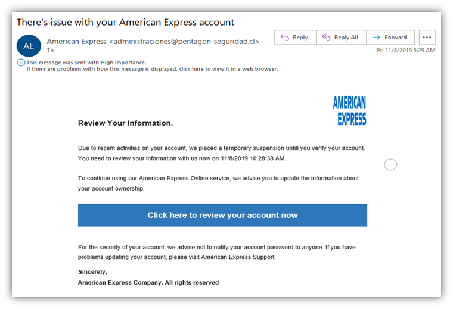

# Incident Report — Phishing Email Impersonating American Express

**Incident ID:** IR-008-2026
**Date Created:** 2026-06-17
**Analyst:** Harry
**Severity:** High
**Status:** Closed

---

## 1. Executive Summary

On 17 June 2026, I performed a static triage of a phishing email impersonating American Express, sourced from a publicly documented phishing campaign for this lab exercise (original send timestamp 8 November 2019, per the email itself — this did not land in my own inbox). The email spoofs American Express branding and leans on urgency language ("temporary suspension," a High Importance flag) to push the recipient toward a "Click here to review your account now" button. The sender address — `administraciones@pentagon-seguridad.cl` — has nothing to do with American Express, which is the single clearest indicator this is fraudulent. This report walks through the indicators visible in the rendered email and is upfront about the limitation of working from a screenshot rather than raw headers.

---

## 2. Incident Overview

| Field | Detail |
|---|---|
| **Incident Type** | Phishing — Credential Harvesting / Brand Impersonation |
| **MITRE Technique** | T1566.002 — Phishing: Spearphishing Link |
| **Impersonated Brand** | American Express |
| **Sample Source** | Publicly documented phishing example, sourced via web search for this exercise — not received in my own mailbox |
| **Original Send Date (per email)** | 8 November 2019, 05:29 |
| **Analysis Date** | 2026-06-17 |
| **Environment** | Static analysis only — no link clicked, no attachment executed |

---

## 3. Detection Source

**Platform:** N/A — this wasn't caught by a SIEM or mail gateway; it's a sourced sample used to practice phishing triage.
**Sample origin:** Found via web search, used in place of a live phishing report since none had hit my own inbox during this lab window.
**Note:** Real phishing triage normally starts with a user-reported email or a mail gateway/SIEM alert. This report simulates the analysis step of that workflow, not the detection step.

---

## 4. Timeline of Events

| Timestamp | Event | Source | Notes |
|---|---|---|---|
| 2019-11-08 05:29 | Email "sent" per its own header display | Email client | Original campaign timestamp — not current |
| 2019-11-08 10:28:38 (claimed) | Body text cites this as the account review "deadline" | Email body | Artificial urgency — an oddly precise timestamp is a common phishing-kit pattern |
| 2026-06-17 | Sample reviewed for this lab exercise | — | Static analysis only, no link clicked |

---

## 5. Indicators Observed

| Indicator Type | Value | Notes |
|---|---|---|
| Sender Display Name | "American Express" | Spoofed — display names are free text and prove nothing |
| Sender Address | `administraciones@pentagon-seguridad.cl` | `.cl` domain, completely unrelated to americanexpress.com |
| Subject Line | "There's issue with your American Express account" | Missing article ("an issue") — grammatically off |
| Priority Flag | High Importance | Artificial urgency |
| Body Text | "suspensiontill" | Missing space/typo, consistent with a reused or translated template |
| Call to Action | "Click here to review your account now" | Generic, unpersonalized button — underlying link destination not visible in this screenshot |

---

## 6. Investigation Notes

**Step 1 — Sender address check**
The display name says "American Express," but the actual address is `administraciones@pentagon-seguridad.cl`. That's the single biggest tell — a `.cl` domain with "pentagon-seguridad" (Spanish for "pentagon security") in it, with no connection to American Express's real domains. Checking the sender address rather than the display name is the first move in any phishing triage, since the display name is trivially spoofable.

**Step 2 — Urgency and pressure tactics**
The High Importance flag, "temporary suspension" language, and the oddly specific deadline ("review your information with us now on 11/8/2019 10:28:38 AM") are all there to get the recipient acting before thinking. A vague threat paired with an artificially precise timestamp is a pattern lifted straight out of a phishing kit template, not how a real financial institution writes account notices.

**Step 3 — Language quality**
"we placed a temporary suspensiontill you verify your account" — the missing space and slightly off phrasing throughout the body is consistent with a template that's been reused, and possibly translated, rather than written by American Express's own communications team. Weaker signal than the sender domain on its own, but it adds up with everything else.

**Step 4 — Call-to-action structure**
The blue "Click here to review your account now" button is the actual payload delivery mechanism. I didn't click it for this analysis — the underlying URL isn't visible in the screenshot. In a real triage, the next step would be pulling the raw link out of the HTML source (or hovering without clicking) and checking it against a URL reputation tool like VirusTotal or urlscan.io before doing anything else with it.

**Step 5 — Closing irony**
"For the security of your account, we advise not to notify your account password to anyone" is the most telling line in the email — boilerplate reassurance text sitting in a template whose entire purpose is to get the recipient to hand those exact credentials to whatever page is behind the button.

**Conclusion:** High-confidence phishing. The sender domain mismatch alone is enough to classify this as malicious — urgency language, grammar, and the generic CTA are all supporting evidence on top of that. The real limitation in this analysis: working from a rendered screenshot instead of the raw email source meant no visibility into SPF/DKIM/DMARC results, Return-Path, or the actual link URL — all of which would normally be the first things pulled in a real triage.

---

## 7. Containment Actions

- No containment needed against a live threat — this was a sourced sample, not something that landed in a real mailbox
- If this had been a live report: block the sender domain at the mail gateway, search org-wide for the same sender/subject to find other recipients, and tell the reporting user not to click the link or enter anything on the page it leads to

---

## 8. Remediation Recommendations

- Enforce SPF, DKIM, and DMARC on domains that could be spoofed, with the mail gateway set to reject or quarantine on failure
- User awareness training should specifically cover checking the sender address, not just the display name — fastest, most reliable check for most phishing emails
- Mail gateway URL rewriting/sandboxing so links are checked before a user can reach the destination
- Standard intake for reported phishing should require the raw email source (.eml or "view original"), not just a forwarded screenshot, so headers are actually available for triage

---

## 9. Lessons Learned

- The sender address is almost always the fastest, most reliable indicator in a phishing email — display names can say anything
- Urgency language plus an oddly specific deadline is a near-universal phishing-kit pattern, regardless of which brand is being impersonated
- Working from a screenshot instead of the raw source is a genuine limitation — full header analysis (SPF/DKIM/DMARC, Return-Path, originating IP) needs the actual source, and that should be the standard intake bar for any reported phishing email
- Brand impersonation phishing doesn't need to be technically sophisticated to work — this one runs entirely on social engineering, with no technical evasion at all

---

## 10. Evidence

| # | Evidence Item | Source |
|---|---|---|
| 1 | `phishing-amex-sample.png` | Rendered phishing email — American Express impersonation |

---

*MITRE ATT&CK: https://attack.mitre.org/techniques/T1566/002/*
*Report prepared as part of the SOC Detection Lab portfolio project. Sample sourced externally for analysis practice — not received in the analyst's own mailbox.*
