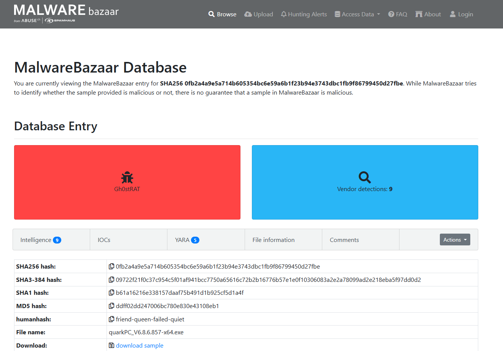
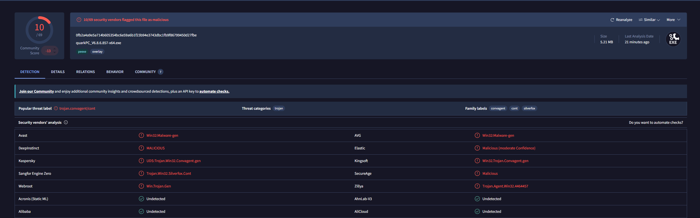

# Incident Report — Malware Hash Triage (Gh0stRAT / SilverFox / ValleyRAT)

**Incident ID:** IR-009-2026
**Date Created:** 2026-06-17
**Analyst:** Harry
**Severity:** High
**Status:** Closed

---

## 1. Executive Summary

On 17 June 2026, I performed a hash-based OSINT triage of a live malware sample pulled from a public malware-sample feed (MalwareBazaar) for analysis practice. This is a real, currently-tagged-malicious file — not something I built, and not something I executed at any point. SHA256 `0fb2a4a9e5a714b605354bc6e59a6b1f23b94e3743dbc1fb9f86799450d27fbe` resolves to `quarkPC_V6.8.6.857-x64.exe` (5,467,121 bytes), an Inno Setup installer wrapping a PECompact-packed payload, identified across sources as Gh0stRAT and cross-tagged SilverFox / ValleyRAT — related Remote Access Trojan and loader families distributed via trojanized installers disguised as PC-optimization tools. VirusTotal flagged it malicious on 10 of 69 engines; MalwareBazaar's richer context — an imphash shared with 89 other Gh0stRAT samples, live C2 infrastructure, and a YARA hit for anti-sandbox evasion — made clear this is a real, active threat despite the comparatively low VT ratio. This report covers the triage only: where the hash came from, what OSINT sources say about it, and why I did not go anywhere near executing it.

---

## 2. Incident Overview

| Field | Detail |
|---|---|
| **Incident Type** | Malware Triage — Hash-Based OSINT Analysis |
| **Malware Family** | Gh0stRAT (cross-tagged SilverFox / ValleyRAT) |
| **MITRE Technique** | T1204.002 — User Execution: Malicious File (primary delivery vector) |
| **Supporting Techniques** | T1497 — Virtualization/Sandbox Evasion; T1071.001 — Application Layer Protocol: Web Protocols (C2) |
| **Sample Source** | MalwareBazaar (abuse.ch) public malware-sample feed — downloaded, never executed |
| **File Name** | `quarkPC_V6.8.6.857-x64.exe` |
| **SHA256** | `0fb2a4a9e5a714b605354bc6e59a6b1f23b94e3743dbc1fb9f86799450d27fbe` |
| **Analysis Date** | 2026-06-17 |
| **Environment** | Static/OSINT only — file isolated on disk, never run, no sandbox detonation performed by me |

---

## 3. Detection Source

**Platform:** N/A — this wasn't caught by my lab's SIEM. It's a public threat-intel lookup exercise on a sample sourced externally.
**Sample origin:** Downloaded from MalwareBazaar's public feed. First seen there 2026-06-17 17:36:34 UTC, submitted by another researcher (tagged "Ling") — not collected from my own environment.
**Note:** Real malware triage in a SOC normally starts when EDR/AV flags a hash or behavior on a live endpoint. This report simulates the triage step that follows — turning a hash into a verdict using OSINT — not the on-host detection step.

---

## 4. Timeline of Events

| Timestamp | Event | Source | Notes |
|---|---|---|---|
| 2026-06-17 17:36 UTC | Sample first seen on MalwareBazaar | MalwareBazaar | Submitted by another researcher, not by me |
| 2026-06-17 | Sample downloaded for this exercise | Local (isolated) | Downloaded only — never executed |
| 2026-06-17 | SHA256 looked up on MalwareBazaar | MalwareBazaar | Full sample report retrieved |
| 2026-06-17 | SHA256 looked up on VirusTotal | VirusTotal | 10/69 engines flagged malicious |

---

## 5. Indicators Observed

| Indicator Type | Value | Notes |
|---|---|---|
| SHA256 | `0fb2a4a9e5a714b605354bc6e59a6b1f23b94e3743dbc1fb9f86799450d27fbe` | Primary lookup hash |
| File Name | `quarkPC_V6.8.6.857-x64.exe` | Disguised as a PC-optimization/cleanup tool installer |
| File Size | 5,467,121 bytes (~5.21 MB) | Consistent across MalwareBazaar and VirusTotal |
| File Type | Inno Setup installer wrapping a PECompact-packed payload | Per TrID identification |
| Imphash | Shared with 89 Gh0stRAT, 22 ValleyRAT, 6 OffLoader samples | Strong signal of shared builder/packer infrastructure across "different" family tags |
| C2 Domain | `oidng2.duoshit.com` | Listed in MalwareBazaar's IOC data |
| C2 IP:Port | `51.79.18.52:443` | HTTPS port — blends with normal encrypted traffic |
| VirusTotal Detection Ratio | 10 / 69 engines | Popular threat label: `trojan.convagent/cont` |
| YARA Match | `TH_AntiVM_MassHunt_Win_Malware_2026_CYFARE` | Anti-VM / anti-sandbox evasion logic present in the binary |

---

## 6. Investigation Notes

**Step 1 — Sourcing and handling**
The sample was already downloaded from MalwareBazaar before I started this writeup. To be explicit about handling: the file has stayed isolated on disk, was never executed, and this entire triage is hash-only — no dynamic or behavioral analysis was performed by me at any point.

**Step 2 — MalwareBazaar lookup**
Searched the SHA256 directly on MalwareBazaar. The sample page returned file metadata, the full hash set (SHA256/SHA1/MD5/SHA3-384), imphash, ssdeep, tags, vendor detections, C2 details, related-sample counts, YARA matches, and a link to a CAPE Sandbox detonation report submitted by another researcher (`capesandbox.com/analysis/71097/`) — I referenced that link's existence as available third-party context but did not visit or rely on it for this report. The tags Gh0stRAT / SilverFox / ValleyRAT all point to the same Chinese-language RAT/loader ecosystem; these names get applied somewhat interchangeably across vendors because the malware-as-a-service builders behind them are shared or related, which the imphash overlap (89 + 22 + 6 samples) backs up directly — same import table, same underlying toolchain, different vendor labels.

**Step 3 — VirusTotal lookup**
Cross-checked the same hash on VirusTotal: 10 of 69 engines flagged it malicious, noticeably less than half. Worth calling out directly — a low detection ratio doesn't mean "probably safe," it more often means a newer or repacked variant that hasn't propagated to every vendor's signature set yet. What matters more is that the engines that did flag it converge on the same verdict despite using independent signature databases: Kaspersky's `UDS:Trojan.Win32.Convagent.gen`, Kingsoft's `Win32.Trojan.Convagent.gen`, and Sangfor's `Trojan.Win32.Silverfox.Cont` are all naming the same underlying threat. That convergence is a stronger signal than the raw vendor count on its own.

**Step 4 — Packing and evasion**
TrID identifies the outer wrapper as an Inno Setup installer — a legitimate, widely used installer framework here used purely as camouflage — containing a PECompact-compressed payload. PECompact is also a legitimate tool, but it's commonly abused to obscure an embedded payload from static signature scanning. Layering two legitimate tools (installer + compressor) around a malicious payload is a deliberate move, and it's consistent with the lower-than-expected VirusTotal ratio I saw. On top of that, one of the matching YARA rules (`TH_AntiVM_MassHunt_Win_Malware_2026_CYFARE`) specifically targets anti-VM/anti-sandbox logic — meaning the payload likely tries to detect when it's running in an analysis environment and change its behavior accordingly. That's exactly why dynamic analysis was out of scope for this report.

**Step 5 — C2 infrastructure**
MalwareBazaar's report lists `oidng2.duoshit.com` resolving to `51.79.18.52` over port 443. Using the standard HTTPS port is a deliberate choice — RAT C2 traffic on 443 blends in with normal encrypted web traffic on a monitored network, which is standard tradecraft for this malware class rather than anything unique to this particular sample.

**Conclusion:** Confirmed malicious. This SHA256 corresponds to a real, currently active Gh0stRAT/SilverFox/ValleyRAT sample distributed under a fake PC-optimization-tool name. Multiple independent sources converge on the same verdict — MalwareBazaar's family tags, VirusTotal's vendor labels, the YARA anti-sandbox match, and the shared imphash infrastructure all point the same direction. No execution, detonation, or behavioral analysis was performed; this is a pure hash/OSINT triage, which is the correct and safest first step for any sample like this entering a real investigation.

---

## 7. Containment Actions

- File was never executed at any point during this exercise
- Sample isolated on disk and slated for deletion now that the hash and OSINT findings are fully documented — it has no further purpose for a hash-only triage
- No network exposure occurred — the C2 IOCs below are documented for blocking, not contacted

---

## 8. Remediation Recommendations

- Block the known IOCs at network egress: domain `oidng2.duoshit.com` and IP `51.79.18.52:443`
- Add the SHA256 (and imphash) to local/EDR blocklists so this sample or close variants get caught on-host automatically
- User awareness: this family distributes under names that look like PC-optimization/cleanup tools — caution against downloading "system speedup" utilities from unverified sources
- For any sample like this in a real SOC workflow, hash-only triage should always be step one — full behavioral analysis, if ever needed, belongs in an isolated, purpose-built sandbox, never on an analyst's own machine

---

## 9. Lessons Learned

- A low VirusTotal detection ratio is not the same as "probably benign" — convergent labeling across independent vendors carries more weight than the raw vendor count
- Imphash overlap across "different" malware tags (Gh0stRAT/SilverFox/ValleyRAT) is a good reminder that malware family names are often vendor-assigned labels for shared underlying infrastructure, not strictly distinct codebases
- Legitimate tools (Inno Setup, PECompact) get layered deliberately to lower static detection rates — packing and wrapping choices are themselves worth documenting as indicators
- Hash-based OSINT triage is safe, fast, and answers "is this malicious" without ever needing to run the file — that should always be the first move before any behavioral analysis is even considered

---

## 10. Evidence

| # | Evidence Item | Source |
|---|---|---|
| 1 | `malwarebazaar-ghostrat-entry.png` | MalwareBazaar — sample entry for this SHA256 |
| 2 | `virustotal-ghostrat-detection.png` | VirusTotal — detection tab, 10/69 vendors flagged malicious |

---

*MITRE ATT&CK: https://attack.mitre.org/techniques/T1204/002/*
*Report prepared as part of the SOC Detection Lab portfolio project. Sample sourced from a public malware-sample feed (MalwareBazaar) for hash-based OSINT triage practice — downloaded only, never executed.*
